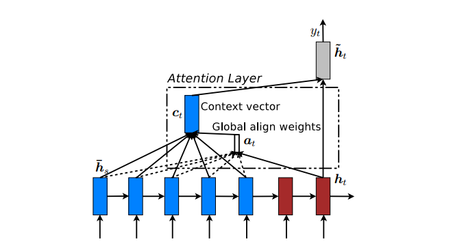

## Attention Mechanism for English to Bangla Translation
MD Muhaimin Rahman
contact: sezan92[at]gmail[dot]com

In this project I have implemented -at least tried to implement- Attention Mechanism for Encoder-Decoder Deep Learning Network for English To Bangla Translation in keras. Neural Machine Translation is a case for Encoder Decoder network. An example is given in Jason Brownlee's [blog](https://machinelearningmastery.com/develop-neural-machine-translation-system-keras/) . But this architecture had a problem for long sentences . Bahdanau et al. used Attention mechanism for Neural Machine Translation , in this [paper](https://arxiv.org/abs/1409.0473). 

### Attention Mechanism
I have used one of the implementations from Luong Thang's phd [thesis](https://github.com/lmthang/thesis). The images is as following . Don't be afraid by the image! 
What attention layer does can be summarized in following points

* Takes Input $i$
* Takes the Hidden state of Encode Input, $h_i = Encoder(i)$
* Takes the Hidden state of Previous Output $h_out = Decoder(i-1)$
* Derives a function with the two hidden state, $ tanh(h_i,h_out) $
* Derives a softmax function from that tanh function $softmax(tanh(h_i,h_out)$
* Multiplies this softmax function with the hidden state of input $h_i \dot softmax(tanh(h_i,h_out)) $
* The attention work is done , the rest is like Decoder Architecture

## Other Keras Implementations?

Not Many keras implementations are available in internet . From them I am doubtful about two implementations.

### Philip Peremy
Philip Peremy tried to show keras Attention [here](https://github.com/philipperemy/keras-attention-mechanism)
